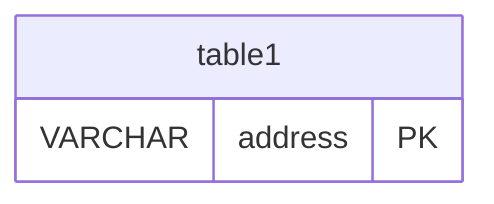

# Database Schema Documentation

This document describes the database schema for the Worlds Content Server. The schema uses PostgreSQL and is managed through migrations located in `src/migrations/`.

## Database Schema Diagram

<!-- Database DER -->

## Tables Overview

The database contains two main tables:

<!-- A list of tables, with their purpose -->

1. **`table1`** - Stores some information

<!-- Description of each table in a section per table -->

## Table: `table1`

<!-- Description of what the table stores -->

Stores all X, Y to do Z.

### Columns

<!-- Description of each column, with its type, nullable characteristic and its description -->

| Column    | Type    | Nullable | Description                                             |
| --------- | ------- | -------- | ------------------------------------------------------- |
| `address` | VARCHAR | NOT NULL | **Primary Key**. Ethereum address. Stored in lowercase. |

### Indexes

<!-- Description of each index -->

- **Primary Key**: `address`
- `index_name` on `X` column

### Constraints

<!-- Description of each constraint the table -->

- **X uniqueness**: The values on the X column must be unique.

### Business Rules

<!-- Description of business rules of the table -->

- **X normalization**: The values on the X column must be lowercased.

### Other

<!-- Description of JSON types or other kind of information about the table -->
