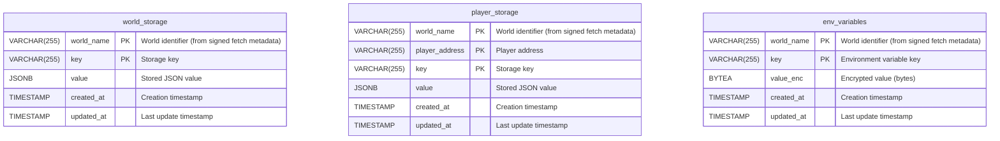

# Database Schema Documentation

This document describes the database schema for the World Storage Service. The schema uses PostgreSQL and is managed through migrations located in `src/migrations/`.

## Database Schema Diagram

<!-- Database DER -->

## Tables Overview

The database contains the following tables:

<!-- A list of tables, with their purpose -->

1. **`world_storage`** - World-scoped key-value storage (JSON) isolated by `world_name`
2. **`player_storage`** - Player-scoped key-value storage (JSON) isolated by `world_name` and `player_address`
3. **`env_variables`** - Encrypted environment variables isolated by `world_name`

<!-- Description of each table in a section per table -->

## Table: `world_storage`

Stores key-value pairs scoped to a world. Each record is uniquely identified by `(world_name, key)`.

### Columns

| Column       | Type         | Nullable | Description |
|--------------|--------------|----------|-------------|
| `world_name` | VARCHAR(255)  | NOT NULL | **Primary Key (part 1)**. World identifier extracted from signed fetch metadata (never from request params/body). |
| `key`        | VARCHAR(255)  | NOT NULL | **Primary Key (part 2)**. Storage key. |
| `value`      | JSONB         | NOT NULL | Stored value as JSON. |
| `created_at` | TIMESTAMP     | NOT NULL | Creation timestamp. Defaults to `current_timestamp`. |
| `updated_at` | TIMESTAMP     | NOT NULL | Last update timestamp. Defaults to `current_timestamp`. |

### Indexes

- **Composite Primary Key**: `(world_name, key)`

### Constraints

- **Primary Key**: `world_storage_pkey` on `(world_name, key)`

### Business Rules

- **World isolation**: `world_name` MUST come from signed fetch metadata; it MUST NOT be accepted from user-controlled inputs (query params, request body).

### Other

- **JSON storage**: `value` is `JSONB` to support arbitrary JSON payloads and efficient JSON querying.

---

## Table: `player_storage`

Stores key-value pairs scoped to a world and a player. Each record is uniquely identified by `(world_name, player_address, key)`.

### Columns

| Column           | Type         | Nullable | Description |
|------------------|--------------|----------|-------------|
| `world_name`     | VARCHAR(255)  | NOT NULL | **Primary Key (part 1)**. World identifier extracted from signed fetch metadata (never from request params/body). |
| `player_address` | VARCHAR(255)  | NOT NULL | **Primary Key (part 2)**. Player identifier (address). |
| `key`            | VARCHAR(255)  | NOT NULL | **Primary Key (part 3)**. Storage key. |
| `value`          | JSONB         | NOT NULL | Stored value as JSON. |
| `created_at`     | TIMESTAMP     | NOT NULL | Creation timestamp. Defaults to `current_timestamp`. |
| `updated_at`     | TIMESTAMP     | NOT NULL | Last update timestamp. Defaults to `current_timestamp`. |

### Indexes

- **Composite Primary Key**: `(world_name, player_address, key)`

### Constraints

- **Primary Key**: `player_storage_pkey` on `(world_name, player_address, key)`

### Business Rules

- **World isolation**: `world_name` MUST come from signed fetch metadata; it MUST NOT be accepted from user-controlled inputs (query params, request body).
- **Player scoping**: All reads/writes for player data must include both `world_name` and `player_address`.

### Other

- **JSON storage**: `value` is `JSONB` to support arbitrary JSON payloads and efficient JSON querying.

---

## Table: `env_variables`

Stores encrypted environment variables scoped to a world. Each record is uniquely identified by `(world_name, key)`.

### Columns

| Column       | Type         | Nullable | Description |
|--------------|--------------|----------|-------------|
| `world_name` | VARCHAR(255)  | NOT NULL | **Primary Key (part 1)**. World identifier extracted from signed fetch metadata (never from request params/body). |
| `key`        | VARCHAR(255)  | NOT NULL | **Primary Key (part 2)**. Environment variable key. |
| `value_enc`  | BYTEA         | NOT NULL | Encrypted value stored as raw bytes. |
| `created_at` | TIMESTAMP     | NOT NULL | Creation timestamp. Defaults to `current_timestamp`. |
| `updated_at` | TIMESTAMP     | NOT NULL | Last update timestamp. Defaults to `current_timestamp`. |

### Indexes

- **Composite Primary Key**: `(world_name, key)`

### Constraints

- **Primary Key**: `env_variables_pkey` on `(world_name, key)`

### Business Rules

- **World isolation**: `world_name` MUST come from signed fetch metadata; it MUST NOT be accepted from user-controlled inputs (query params, request body).
- **Encrypted at rest**: `value_enc` stores encrypted bytes; encryption/decryption is handled by the service.

### Other

- **Encrypted storage**: `value_enc` is `BYTEA` to store ciphertext as bytes.
