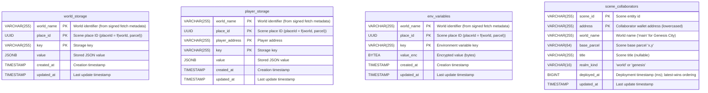

# Database Schema Documentation

This document describes the database schema for the World Storage Service. The schema uses PostgreSQL and is managed through migrations located in `src/migrations/`.

## Database Schema Diagram

<!-- Database DER -->

```mermaid
erDiagram
  world_storage {
    VARCHAR(255) world_name PK "World identifier (from signed fetch metadata)"
    UUID place_id PK "Scene place ID (placeId = f(world, parcel))"
    VARCHAR(255) key PK "Storage key"
    JSONB value "Stored JSON value"
    TIMESTAMP created_at "Creation timestamp"
    TIMESTAMP updated_at "Last update timestamp"
  }

  player_storage {
    VARCHAR(255) world_name PK "World identifier (from signed fetch metadata)"
    UUID place_id PK "Scene place ID (placeId = f(world, parcel))"
    VARCHAR(255) player_address PK "Player address"
    VARCHAR(255) key PK "Storage key"
    JSONB value "Stored JSON value"
    TIMESTAMP created_at "Creation timestamp"
    TIMESTAMP updated_at "Last update timestamp"
  }

  env_variables {
    VARCHAR(255) world_name PK "World identifier (from signed fetch metadata)"
    UUID place_id PK "Scene place ID (placeId = f(world, parcel))"
    VARCHAR(255) key PK "Environment variable key"
    BYTEA value_enc "Encrypted value (bytes)"
    TIMESTAMP created_at "Creation timestamp"
    TIMESTAMP updated_at "Last update timestamp"
  }

  scene_collaborators {
    VARCHAR(255) scene_id PK "Scene entity id"
    VARCHAR(255) address PK "Collaborator wallet address (lowercased)"
    VARCHAR(255) world_name "World name ('main' for Genesis City)"
    VARCHAR(64) base_parcel "Scene base parcel 'x,y'"
    VARCHAR(255) title "Scene title (nullable)"
    VARCHAR(16) realm_kind "'world' or 'genesis'"
    BIGINT deployed_at "Deployment timestamp (ms); latest-wins ordering"
    TIMESTAMP updated_at "Last update timestamp"
  }
```

## Tables Overview

The database contains the following tables:

<!-- A list of tables, with their purpose -->

1. **`world_storage`** - World-scoped key-value storage (JSON) isolated by `world_name` and `place_id`
2. **`player_storage`** - Player-scoped key-value storage (JSON) isolated by `world_name`, `place_id`, and `player_address`
3. **`env_variables`** - Encrypted environment variables isolated by `world_name` and `place_id`
4. **`scene_collaborators`** - Reverse index of scene collaborators (wallets in a scene's `logsPermissions`), keyed by `(scene_id, address)`; powers `GET /collaborator` discovery

<!-- Description of each table in a section per table -->

## Table: `world_storage`

Stores key-value pairs scoped to a world and scene. Each record is uniquely identified by `(world_name, place_id, key)`.

### Columns

| Column       | Type         | Nullable | Description |
|--------------|--------------|----------|-------------|
| `world_name` | VARCHAR(255)  | NOT NULL | **Primary Key (part 1)**. World identifier extracted from signed fetch metadata (never from request params/body). |
| `place_id`   | UUID          | NOT NULL | **Primary Key (part 2)**. Scene place ID (`placeId = f(world, parcel)`); scopes storage to a specific scene/place within the world. |
| `key`        | VARCHAR(255)  | NOT NULL | **Primary Key (part 3)**. Storage key. |
| `value`      | JSONB         | NOT NULL | Stored value as JSON. |
| `created_at` | TIMESTAMP     | NOT NULL | Creation timestamp. Defaults to `current_timestamp`. |
| `updated_at` | TIMESTAMP     | NOT NULL | Last update timestamp. Defaults to `current_timestamp`. |

### Indexes

- **Composite Primary Key**: `(world_name, place_id, key)`

### Constraints

- **Primary Key**: `world_storage_pkey` on `(world_name, place_id, key)`

### Business Rules

- **World isolation**: `world_name` MUST come from signed fetch metadata; it MUST NOT be accepted from user-controlled inputs (query params, request body).

### Other

- **JSON storage**: `value` is `JSONB` to support arbitrary JSON payloads and efficient JSON querying.

---

## Table: `player_storage`

Stores key-value pairs scoped to a world, scene, and player. Each record is uniquely identified by `(world_name, place_id, player_address, key)`.

### Columns

| Column           | Type         | Nullable | Description |
|------------------|--------------|----------|-------------|
| `world_name`     | VARCHAR(255)  | NOT NULL | **Primary Key (part 1)**. World identifier extracted from signed fetch metadata (never from request params/body). |
| `place_id`       | UUID          | NOT NULL | **Primary Key (part 2)**. Scene place ID (`placeId = f(world, parcel)`); scopes storage to a specific scene/place within the world. |
| `player_address` | VARCHAR(255)  | NOT NULL | **Primary Key (part 3)**. Player identifier (address). |
| `key`            | VARCHAR(255)  | NOT NULL | **Primary Key (part 4)**. Storage key. |
| `value`          | JSONB         | NOT NULL | Stored value as JSON. |
| `created_at`     | TIMESTAMP     | NOT NULL | Creation timestamp. Defaults to `current_timestamp`. |
| `updated_at`     | TIMESTAMP     | NOT NULL | Last update timestamp. Defaults to `current_timestamp`. |

### Indexes

- **Composite Primary Key**: `(world_name, place_id, player_address, key)`

### Constraints

- **Primary Key**: `player_storage_pkey` on `(world_name, place_id, player_address, key)`

### Business Rules

- **World isolation**: `world_name` MUST come from signed fetch metadata; it MUST NOT be accepted from user-controlled inputs (query params, request body).
- **Player scoping**: All reads/writes for player data must include both `world_name` and `player_address`.

### Other

- **JSON storage**: `value` is `JSONB` to support arbitrary JSON payloads and efficient JSON querying.

---

## Table: `env_variables`

Stores encrypted environment variables scoped to a world and scene. Each record is uniquely identified by `(world_name, place_id, key)`.

### Columns

| Column       | Type         | Nullable | Description |
|--------------|--------------|----------|-------------|
| `world_name` | VARCHAR(255)  | NOT NULL | **Primary Key (part 1)**. World identifier extracted from signed fetch metadata (never from request params/body). |
| `place_id`   | UUID          | NOT NULL | **Primary Key (part 2)**. Scene place ID (`placeId = f(world, parcel)`); scopes env vars to a specific scene/place within the world. |
| `key`        | VARCHAR(255)  | NOT NULL | **Primary Key (part 3)**. Environment variable key. |
| `value_enc`  | BYTEA         | NOT NULL | Encrypted value stored as raw bytes. |
| `created_at` | TIMESTAMP     | NOT NULL | Creation timestamp. Defaults to `current_timestamp`. |
| `updated_at` | TIMESTAMP     | NOT NULL | Last update timestamp. Defaults to `current_timestamp`. |

### Indexes

- **Composite Primary Key**: `(world_name, place_id, key)`

### Constraints

- **Primary Key**: `env_variables_pkey` on `(world_name, place_id, key)`

### Business Rules

- **World isolation**: `world_name` MUST come from signed fetch metadata; it MUST NOT be accepted from user-controlled inputs (query params, request body).
- **Encrypted at rest**: `value_enc` stores encrypted bytes; encryption/decryption is handled by the service.

### Other

- **Encrypted storage**: `value_enc` is `BYTEA` to store ciphertext as bytes.

---

## Table: `scene_collaborators`

Reverse index of a scene's collaborators, keyed by `(scene_id, address)`. A collaborator is a wallet in the scene's `logsPermissions` (the only grant source at this time), which authorizes read/write/delete on that scene's storage. Powers the self-scoped `GET /collaborator` discovery endpoint.

### Columns

| Column        | Type         | Nullable | Description |
|---------------|--------------|----------|-------------|
| `scene_id`    | VARCHAR(255) | NOT NULL | **Primary Key (part 1)**. Scene entity id. |
| `address`     | VARCHAR(255) | NOT NULL | **Primary Key (part 2)**. Collaborator wallet address, lowercased. |
| `world_name`  | VARCHAR(255) | NOT NULL | World name; `main` for Genesis City scenes. |
| `base_parcel` | VARCHAR(64)  | NOT NULL | Scene base parcel `x,y`. Together with `world_name` it identifies the scene location for latest-wins replacement. |
| `title`       | VARCHAR(255) | NULL     | Scene title (from metadata), or null. |
| `realm_kind`  | VARCHAR(16)  | NOT NULL | `world` or `genesis`. |
| `deployed_at` | BIGINT       | NOT NULL | Deployment timestamp (ms), default 0. Used to order deployment events so a stale/out-of-order event cannot overwrite a newer one. |
| `updated_at`  | TIMESTAMP    | NOT NULL | Last update timestamp. Defaults to `current_timestamp`. |

### Indexes

- **Composite Primary Key**: `(scene_id, address)`
- **`scene_collaborators_address_idx`** on `(address)` — serves the `GET /collaborator` lookup by signer.

### Constraints

- **Primary Key**: `scene_collaborators_pkey` on `(scene_id, address)`

### Business Rules

- **Discovery only, never an authorization source**: the index answers "which scenes might this wallet collaborate on" for the `GET /collaborator` UX. Authorization never reads it. Every storage request re-checks `logsPermissions` against the deploying content server's scene metadata (Worlds Content Server for worlds, catalyst for Genesis City). That metadata is cached for up to `SCENE_METADATA_CACHE_TTL_SECONDS` (default 30s), so the check is per-request but not strictly instantaneous: a revoked collaborator loses access within that TTL window.
- **Eventually consistent, best-effort by design**: the index is fed by deployment/undeployment events (SQS, at-most-once) plus a write-through on first authorized access. It can lag or hold stale entries; because authorization never trusts it, staleness affects only the discovery list, never access. Three staleness sources are expected and accepted:
  1. **Reordered / concurrent events** — the `deployed_at` guard resolves the common case, but an empty-`logsPermissions` replacement or an undeployment drops the per-location watermark, so a delayed older event can briefly restore a revoked collaborator until the next event for that location.
  2. **Dropped events** — the consumer acknowledges each message once; a deployment dropped on a transient upstream failure is not retried.
  3. **Pre-existing scenes** — scenes deployed before the SQS subscription existed emit no event this service saw. There is no full bootstrap/reconciliation: Genesis City's scene space is effectively unbounded and cannot be enumerated.
  For (2) and (3), the self-heal is the write-through on first authorized access (a collaborator who uses a scene's storage backfills its row) or a later redeployment. A dormant scene whose collaborator never accesses storage may stay absent from discovery indefinitely — collaborators can always reach a scene directly by realm/parcel, so this is a UX gap, not an access one.
- **Latest deployment wins**: a destructive replacement at a `(world_name, base_parcel)` location is skipped when an indexed row there has a higher `deployed_at`, so in-order and most out-of-order SQS delivery cannot resurrect a stale scene (see staleness source 1 for the residual empty-set/undeployment case).
